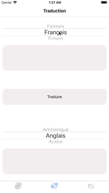

#  Baluchon

### L'application Baluchon
Baluchon est un sac de voyage virtuel avec des outils indispensables pour les voyages à l'étranger.

**l'application se compose de trois fonctionnalités principales :**
* Le taux de change
* La traduction
* La météo
### Les Bonus
**Plusieurs fonctionnalités bonus ont été rajoutées à l'application Baluchon :**

> 1. La conversion de monnaies dans de nombreuses devises
> 2. la conversion de monnaies peut ce faire de n’importe quelle monnaie à n’importe quelle monnaie parmi celles proposées
> 3. la possibilité d’afficher la météo de nombreuses villes dans le monde.
> 4. la possibilité d’ajouter ou d’enlever n’importe laquelle des villes de notre affichage
> 5. Un sélecteur pour échanger la langue d'origine et la langue de destination pour la traduction.
> 6. la possibilité de traduire dans n’importe quelle langue proposée.

**Attention pensez à renseigner vos clés pour les API Google et Fixer dans le fichier Constant lors de l'installation**

### Implémentation des Bonus

>> 1. La conversion de monnaies dans de nombreuses devises

afin de pouvoir convertir les monnaies dans de nombreuses devises, nous allons récupérer tous les taux de changes proposés par fixer.io dans un objet grâce à notre appel réseau et créer une propriété "*change*" avec cet objet.

    let change = object as? Change

avant de pouvoir utiliser cet objet nous allons chaîner notre appel réseau avec un deuxième appel pour récupérer toujours sur fixer.io avec une deuxième API la liste des monnaies dans un objet et de même que pour les taux, créer une propriété appelée "*money*".

    let money = object as? Money

Ensuite nous n'aurons plus qu'à passer les deux objets dans notre callback à notre controller, voici ce que ça donne dans "*ChangeService*" :

    func getChange(callback: @escaping (String?, Change?, Money?) -> Void) {
        changeRouter.request(changeAPI, changeSession, Change.self) { (error, object) in
            DispatchQueue.main.async {
                guard error == nil else {
                    callback(error, nil, nil)
                    return
                }
                self.getMoney { (error, money) in
                    guard let money = money else {
                        callback(error, nil, nil)
                        return
                    }
                    let change = object as? Change
                    callback(nil, change, money)
                }
            }
        }
    }

Le controller n'aura plus qu'à appeler la méthode :

    private func changeValueText(_ moneyToConvertName: String, _ moneyConvertedName: String, _ sender: UITextField)

par le biais d'Action, elle même appelera la méthode "*changeMoney*" de "*ChangeService*" pour faire le calcul selon les choix effectués par l'utilisateur grâce aux pickerViews de choix des monnaies et bien sûr selon le nombre à convertir :

    func changeMoney(_ moneyToConvertName: String, _ moneyConvertedName: String,_ valueNeedToConvert: String,_ change: Change,_ money: Money) -> Double {

        let abreviationOne = searchMoney(moneyName: moneyToConvertName, moneyData: money)
        let abreviationTwo = searchMoney(moneyName: moneyConvertedName, moneyData: money)
        let moneySelectedValueForOneEuro = change.rates[abreviationOne]!
        let currencyWeNeed = change.rates[abreviationTwo]!

        var number: Double
        guard (Double(valueNeedToConvert) != nil) else {
            return 0
        }
        number = Double(valueNeedToConvert)!
        var result : Double
        if moneySelectedValueForOneEuro == 1.0 {
            result = number * currencyWeNeed
        } else {
            let numberToConvert = number / moneySelectedValueForOneEuro
            result = numberToConvert * currencyWeNeed
        }
        return result
    }

Cette méthode comme on peut le voir ci-dessus va d'abord retrouver l'abréviation de la monnaie désignée par l'utilisateur pour rechercher le taux de celle ci dans l'objet "*change*"

Ensuite selon le choix de la monnaie d'origine et le choix de la devise souhaitée, cette méthode va faire le calcul.

>>  2. la conversion de monnaies peut ce faire de n’importe quelle monnaie à n’importe quelle monnaie parmi celles proposées

Ce bonus est principalement géré par les pickersViews et les textFields qui vont permettre avec les objets et méthodes précédemment expliqués la conversion de monnaies dans n'importe quel sens voulu par l'utilisateur.

la modification d'un textField entrainera instantanément le calcul et l'affichage du résultat dans le deuxième textField.

le changement d'un pickerViews changera instantanément la valeur calculée dans le textField opposé.

> Voici une animation présentant ce bonus.

>> 3. la possibilité d’afficher la météo de nombreuses villes dans le monde.

Cette fonctionnalité va nous permettre par le biais d'une action dans le controller "*AddNewCityViewController*" de lancer un appel réseau et d'obtenir la météo d'une ville en particulier choisie par l'utilisateur.

>> 4. la possibilité d’ajouter ou d’enlever n’importe laquelle des villes de notre affichage

Cette fonctionnalité consiste en l'ajout d'une tableView qui va permettre l'affichage des villes choisies et va permettre la suppression de celles que l'utilisateur ne voudrait plus.

Afin de pouvoir afficher plusieurs villes, une variables static contenant un array avec le nom des villes préalablement choisies permettra la gestion des villes à afficher par la tableView.

    static var allCity = ["New York","Quimper","Nantes"]

pour ajouter une nouvelle ville un bouton "+" permettra d'accéder à la page d'ajout de villes.

> Une bonne animation valant mieux qu'un long discours :

>> 5. Un sélecteur pour échanger la langue d'origine et la langue de destination pour la traduction.

Ce sélecteur consiste en deux pickerViews placé au dessus des textViews, qui vont permettre de changer la langue d'origine et la langue de destination.

ces pickerViews sont alimentés par un appel réseau via une API de Google qui va récupérer la liste des langues supportées par l'API de traduction de Google.

    func getLanguage(completionHandler: @escaping (String?, Language?) -> Void) {
        languageAPI.body = createLanguageBodyRequest()
        languageRouter.request(languageAPI, languageSession, Language.self) { (error, object) in
            DispatchQueue.main.async {
                guard error == nil else {
                    completionHandler(error, nil)
                    return
                }
                let language = object as? Language
                completionHandler(nil, language)
            }
        }
    }

L'objet "*language*" renvoyé par le completionHandler va permettre de créer un tableau avec le nom des langues disponibles pour la traduction.

>> 6. la possibilité de traduire dans n’importe quelle langue proposée.

Avec le choix des langues effectuées par le biais des pickerViews, l'appel réseau va pouvoir préciser dans la requête la langue d'origine et la langue de destination et ainsi permettre la traduction dans les langues choisies.

la création de cette partie de la requête se fera via une méthode renseignée par le viewController via des paramètres.

**voici comment va se créer la partie de la requête concernant ce choix de langues :**

    private func createTranslateBodyRequest(textToTranslate: String, languageToTranslate: String, languageTranslated: String) -> [String:String] {
        return ["source":languageToTranslate, "target":languageTranslated, "q":textToTranslate, "format":"text"]
    }

> Pour voir le fonctionnement de ce bonus voici une nouvelle fois une petite animation :

